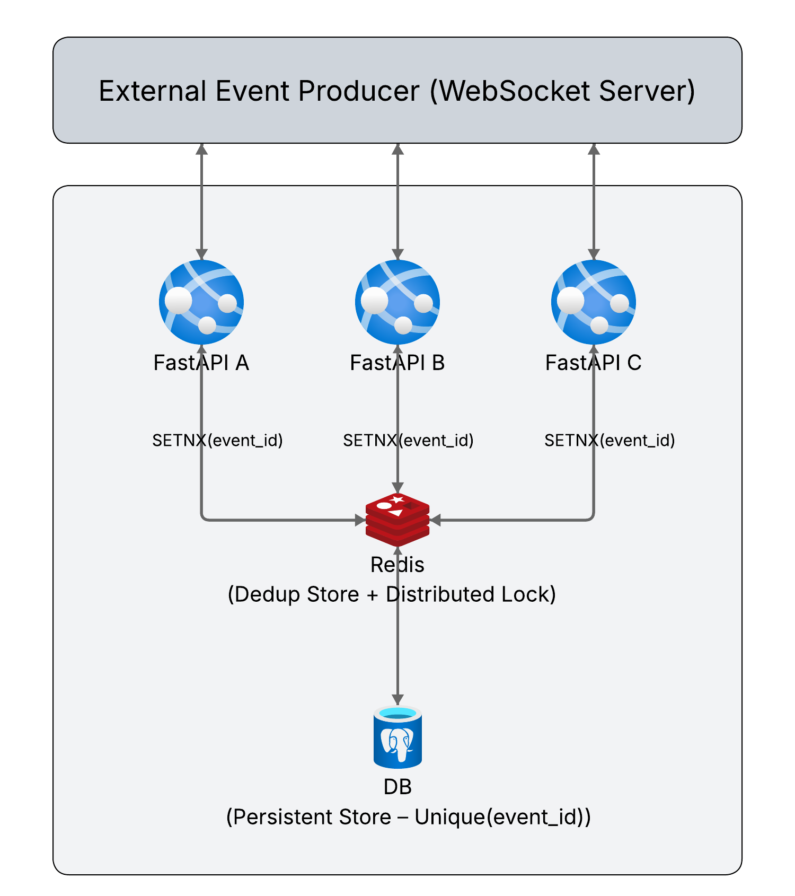

# Distributed Event Deduplication for WebSocket Listeners

## Overview

This project implements a **reliable distributed deduplication mechanism** for WebSocket event listeners. In environments where multiple listener instances receive duplicate events, the system guarantees that **each event is processed and persisted exactly once (logically once)** using a shared coordination store.

The solution is designed to:

* Tolerate **partial failures** (crashes, restarts, retries)
* Prevent **double processing and side effects**
* Scale horizontally with **high throughput and many listeners**

---

## Problem Statement

Multiple FastAPI instances are connected to the same WebSocket source. The same event may be delivered to multiple instances concurrently. We must ensure:

1. Only **one instance** processes and persists each event
2. The system is **safe under crashes and retries**
3. The architecture scales without race conditions

---

## Architecture



### Component Roles

| Component             | Responsibility                           |
| --------------------- | ---------------------------------------- |
| **WebSocket**         | Event transport (fan-out delivery)       |
| **FastAPI instances** | Receive events and attempt to process    |
| **Redis**             | Atomic ownership claim (deduplication)   |
| **Database**          | Final persistence with unique constraint |

> **Important:** Redis is used only for coordination (deduplication), not for event transport or broadcasting.

---

## Design Principles

### 1. Atomic Ownership Claim

We use Redis `SET NX` to atomically claim an event:

```
SET dedup:{event_id} <instance_id> NX EX <ttl>
```

* `NX` → only set if not exists (atomic)
* `EX` → TTL for crash recovery

Only one instance can claim a given `event_id`.

---

### 2. Instance Identity

Each process generates a unique `instance_id` at startup (e.g., UUID). This ensures:

* Correct ownership tracking
* Safe lock release (only the owner can release)

---

### 3. Crash Recovery with TTL

Locks are created with TTL so that if a process crashes:

* The lock is automatically released
* The event can be retried safely

TTL is set **higher than the maximum expected processing time** to avoid premature expiry.

---

### 4. Idempotency for Side Effects

All side effects (DB writes, API calls, payments, emails) are designed to be **idempotent** using `event_id` as the idempotency key.

This guarantees safety under retries and partial execution.

---

## Consistency Guarantees

* **Delivery:** At-least-once (WebSocket may deliver duplicates)
* **Processing:** Exactly-once semantics (logical)
* **Persistence:** Exactly-once enforced via Redis dedup + DB unique constraint

---

## Algorithm / Flow

### High-Level Flow

1. Receive event from WebSocket
2. Extract `event_id`
3. Attempt atomic claim in Redis
4. If claim fails → ignore event
5. If claim succeeds → process event
6. Persist event to DB
7. On failure → release lock (only if owner)

---

### Pseudocode

```
onEvent(event):
    eventId = event.id

    claimed = redis.SET("dedup:" + eventId, instanceId, NX, EX=TTL)

    if not claimed:
        return  # duplicate, ignore

    try:
        process(event)        # idempotent operations
        persist(event)        # DB insert with unique constraint
    except:
        if redis.GET("dedup:" + eventId) == instanceId:
            redis.DEL("dedup:" + eventId)
        raise
```

---

## Failure Modes & Recovery

### 1. Instance crashes after claiming

* Redis TTL expires
* Event becomes available for retry

### 2. Instance crashes during processing

* Partial execution assumed
* TTL ensures delayed recovery
* Idempotency prevents duplicate side effects

### 3. Competing instances

* Redis `SET NX` guarantees only one winner

### 4. Redis restart

* Keys lost → events may reprocess
* DB unique constraint prevents duplicate persistence

---

## Scaling Strategy

### Horizontal Scaling

* FastAPI instances are stateless
* Add more instances to increase throughput

### Redis Scaling

* Redis operations are O(1)
* Can be clustered for high throughput

### Bottlenecks & Mitigation

| Bottleneck           | Mitigation                                  |
| -------------------- | ------------------------------------------- |
| Redis                | Use Redis Cluster / sharding                |
| Database             | Batch inserts, indexing, connection pooling |
| WebSocket throughput | Load balancer, multiple connections         |

---

## Testing Strategy

### 1. Concurrency Simulation

* Run multiple FastAPI instances
* Send same event concurrently
* Verify only one DB record is created

### 2. Crash Simulation

* Kill instance after claiming lock
* Verify TTL expiry allows retry

### 3. Duplicate Injection

* Send same event multiple times
* Validate idempotency

### 4. Load Testing

* High-frequency events
* Observe Redis + DB behavior

---

## Guarantees Summary

| Aspect           | Guarantee                    |
| ---------------- | ---------------------------- |
| Event Processing | Exactly-once (logical)       |
| Persistence      | Exactly-once (DB constraint) |
| Side Effects     | Idempotent                   |
| Crash Recovery   | TTL-based                    |
| Race Conditions  | Prevented via atomic claim   |

---

## Why This Design Works

* **Redis SET NX** provides atomicity
* **TTL** ensures recovery from crashes
* **Instance ID** ensures safe ownership
* **DB unique constraint** is final safety net
* **Idempotency** prevents real-world damage

This combination ensures correctness under concurrency, failures, and retries.

---

## Final Note

This solution is intentionally simple, robust, and production-oriented. It avoids over-engineering while handling the hardest real-world failure cases in distributed systems.

---

## How to Run

1. Start Redis
2. Run multiple FastAPI instances
3. Connect WebSocket source
4. Send events with unique `event_id`
5. Observe deduplication in action

---

## Author

Muhammed Fayiz
